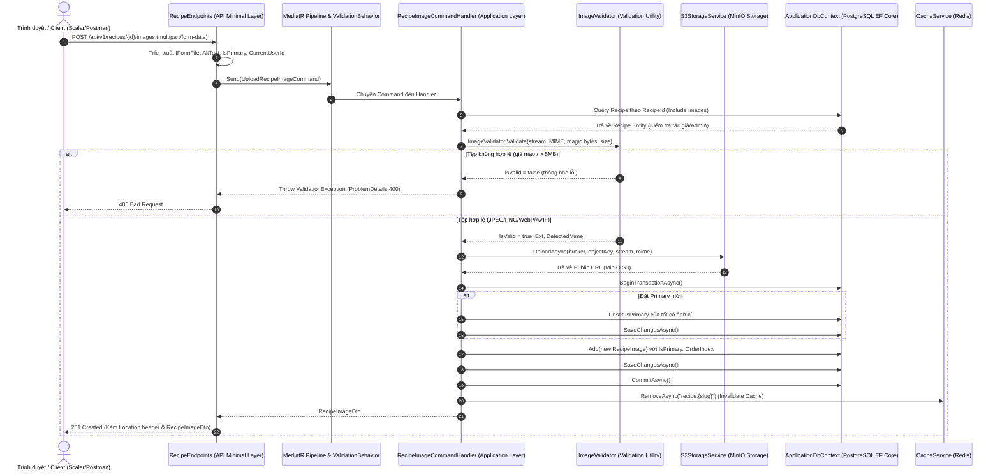

# TÀI LIỆU TOÀN DIỆN VỀ QUẢN LÝ RECIPE IMAGE (COMPLAN)
## HỌC PHẦN: PHÁT TRIỂN ỨNG DỤNG WEB NÂNG CAO - NHÓM 12
**Sinh viên thực hiện:** Võ Hùng Mạnh  
**Chức năng phụ trách:** Quản lý Hình ảnh Công thức Nấu ăn (`RecipeImage`) thuộc Task 4  
**Tài liệu dành cho:** Tự học, ôn tập và báo cáo bảo vệ đồ án trước Giảng viên  

---

## 1. TỔNG QUAN VỀ RECIPE IMAGE

### 1.1. RecipeImage là gì?
`RecipeImage` (Hình ảnh của công thức) là thực thể (Entity: đối tượng đại diện cho một bảng dữ liệu trong cơ sở dữ liệu) dùng để lưu trữ thông tin về hình ảnh minh họa cho món ăn trong hệ thống CulinaryBlog.

### 1.2. Mối quan hệ giữa Recipe và RecipeImage
Mối quan hệ giữa `Recipe` (Công thức) và `RecipeImage` là **Một - Nhiều (One-to-Many)**:
- Một công thức (`Recipe`) có thể có nhiều hình ảnh (`RecipeImage`) mô tả ở các góc chụp khác nhau, thành phẩm, bày trí trên bàn ăn.
- Mỗi hình ảnh (`RecipeImage`) chỉ thuộc về duy nhất một công thức thông qua khóa ngoại (`Foreign Key`: cột dùng để liên kết dữ liệu giữa hai bảng) mang tên `RecipeId`.

### 1.3. Tại sao một Recipe cần nhiều Image?
Một công thức ẩm thực chất lượng không thể chỉ có một tấm hình duy nhất. Người đọc cần thấy:
1. Ảnh chụp góc nghiêng tổng thể món ăn (ảnh đại diện).
2. Ảnh chụp cận cảnh (macro) độ mọng của thịt, màu nước dùng.
3. Ảnh chụp mâm cơm hoàn chỉnh sau khi bày trí.
Do đó, hệ thống thiết kế cho phép tải lên nhiều ảnh cho cùng một công thức.

### 1.4. Các khái niệm cốt lõi:
- **Primary Image (Ảnh đại diện chính):** Là ảnh quan trọng nhất của công thức, được gắn cờ `IsPrimary = true`. Ảnh này sẽ hiển thị ở trang danh sách tìm kiếm, thẻ tóm tắt (Card) và banner đầu bài viết. Theo quy tắc nghiệp vụ (Business Rule) của hệ thống: **Mỗi công thức chỉ được có duy nhất một ảnh Primary đang hoạt động (`IsDeleted = false`) tại một thời điểm**.
- **OrderIndex (Thứ tự hiển thị):** Là số nguyên (`int >= 0`) xác định thứ tự sắp xếp của các ảnh trong bộ sưu tập (Gallery). Ảnh có `OrderIndex` nhỏ hơn sẽ được ưu tiên hiển thị trước.
- **AltText (Văn bản thay thế - Alternative Text):** Là chuỗi mô tả nội dung hình ảnh (tối đa 200 ký tự theo đặc tả SRS). Trường này phục vụ khả năng tiếp cận (Accessibility cho người khiếm thị dùng phần mềm đọc màn hình Screen Reader) và hỗ trợ tối ưu hóa công cụ tìm kiếm (SEO - Search Engine Optimization).

### 1.5. Ví dụ thực tế với Recipe "Phở bò Hà Nội"
Giả sử người dùng tạo công thức **"Phở bò Hà Nội"** (`RecipeId = "11111111-..."`):
1. **Ảnh 1 (Tô phở bốc khói):** Tải lên đầu tiên. Hệ thống tự động gán `OrderIndex = 0`, `IsPrimary = true`, `AltText = "Tô phở bò tái chín bốc khói thơm lừng với hành hoa"`. Đây là ảnh đại diện.
2. **Ảnh 2 (Cận cảnh thịt bò tái lăn):** Tải lên tiếp theo. Hệ thống gán `OrderIndex = 1`, `IsPrimary = false`, `AltText = "Cận cảnh từng lát thịt bò tươi mềm thái mỏng"`.
3. **Ảnh 3 (Đĩa quẩy giòn và chanh ớt):** Tải lên sau cùng. Hệ thống gán `OrderIndex = 2`, `IsPrimary = false`, `AltText = "Quẩy giòn ăn kèm phở và lát chanh tươi"`.

---

## 2. KIẾN TRÚC VÀ LUỒNG DỮ LIỆU (ARCHITECTURE & FLOW)

### 2.1. Sơ đồ tuần tự xử lý (Data Flow Diagram)
Hệ thống tuân thủ kiến trúc phân tầng (Clean Architecture / Onion Architecture) kết hợp mô hình CQRS (Command Query Responsibility Segregation: phân tách lệnh ghi và truy vấn):



### 2.2. Giải thích vai trò từng tầng (Layer Responsibilities):
1. **API Layer (`CulinaryBlog.Api`):**
   - Đóng vai trò cửa ngõ nhận yêu cầu HTTP.
   - Định nghĩa Route, lọc Header, đọc dữ liệu từ Form Multipart (`IFormFile`).
   - Kiểm tra thông tin xác thực (`ClaimsPrincipal`), lấy `userId` và `role`.
   - Bắt các biệt lệ (Exceptions) như `NotFoundException`, `ForbiddenException`, `ValidationException` để trả về mã HTTP chuẩn (`400`, `403`, `404`, `503`).
2. **Application Layer (`CulinaryBlog.Application`):**
   - Chứa toàn bộ nghiệp vụ cốt lõi (Business Logic).
   - Tách biệt các yêu cầu thành Command/Query thông qua MediatR.
   - Quản lý logic: tự động thăng hạng Primary cho ảnh đầu tiên, hoán đổi Primary, tự động tìm ảnh thay thế khi xóa Primary.
   - Điều phối giao dịch database (Transaction) và xóa bộ nhớ đệm (Cache Invalidation).
3. **Domain Layer (`CulinaryBlog.Domain`):**
   - Chứa thực thể `RecipeImage` độc lập với framework, mô tả dữ liệu thuần túy của bài toán.
4. **Infrastructure Layer (`CulinaryBlog.Infrastructure`):**
   - Cung cấp triển khai kỹ thuật cụ thể:
     + `ApplicationDbContext` (EF Core kết nối PostgreSQL).
     + `S3StorageService` (kết nối MinIO qua giao thức Amazon S3).
     + Redis Caching.
5. **Storage Layer (MinIO) & Database Layer (PostgreSQL):**
   - MinIO: Lưu tệp nhị phân ảnh (Binary file) để tối ưu băng thông và giảm tải cơ sở dữ liệu.
   - PostgreSQL: Lưu thông tin mô tả (Metadata: đường dẫn URL, AltText, OrderIndex, trạng thái xóa mềm).

---

## 3. BẢNG DANH SÁCH TẤT CẢ FILE ĐÃ SỬA VÀ TẠO MỚI

| File | Tầng (Layer) | Chức năng chính | Vì sao phải sửa / tạo |
| :--- | :--- | :--- | :--- |
| `backend/src/CulinaryBlog.Application/Common/Utilities/ImageValidator.cs` | Application / Utilities | Bộ kiểm tra an toàn tệp ảnh: dung lượng tối đa 5 MB, danh sách MIME cho phép, kiểm tra Magic bytes (chữ ký số tệp) cho JPEG, PNG, WebP, AVIF | **Tạo mới:** Đảm bảo an ninh tệp tin, chống người dùng đổi đuôi file độc hại (như `virus.exe` đổi tên thành `anh.jpg`) tải lên server. |
| `backend/src/CulinaryBlog.Application/Features/Recipes/Commands/RecipeImages/RecipeImageCommands.cs` | Application / Commands | Khai báo các Command: `UploadRecipeImageCommand`, `UpdateRecipeImageCommand`, `AddRecipeImageCommand`, `SetPrimaryRecipeImageCommand`, `DeleteRecipeImageCommand` và Handler xử lý tập trung | **Cập nhật:** Bổ sung logic Multipart Upload tệp lên MinIO, bổ sung lệnh PATCH cập nhật linh hoạt (AltText, OrderIndex, IsPrimary), tối ưu transaction hoán đổi cờ Primary. |
| `backend/src/CulinaryBlog.Api/Endpoints/Recipes/RecipeEndpoints.cs` | API / Endpoints | Đăng ký các Endpoint Minimal API: POST (Multipart Upload), PATCH (Cập nhật), DELETE (Xóa mềm) | **Cập nhật:** Hỗ trợ nhận Form Multipart cho `POST /images`, định tuyến chuẩn REST `PATCH /images/{imageId}`, bắt và trả về ProblemDetails 400 khi validation thất bại. |
| `backend/tests/CulinaryBlog.UnitTests/Application/Common/RecipeImageValidationTests.cs` | Unit Tests | Kiểm thử tự động độc lập cho `ImageValidator` | **Tạo mới:** Đảm bảo kiểm tra toàn diện 100% các ca: file hợp lệ, vượt quá 5MB, rỗng, sai MIME, đổi đuôi virus EXE thành JPG, file HTML giả mạo PNG. |
| `backend/tests/CulinaryBlog.IntegrationTests/Program.cs` | Integration Tests | Kiểm thử tích hợp toàn hệ thống với Database thật | **Cập nhật:** Bổ sung kịch bản kiểm tra `UpdateRecipeImageCommand` (PATCH), `UploadRecipeImageCommand` (Stream JPEG) và chặn file giả mạo đuôi EXE. |
| `.gitignore` | Configuration | Cấu hình bỏ qua runtime log | **Cập nhật:** Bỏ qua thư mục `backend/src/CulinaryBlog.Api/logs/` để giữ working tree luôn sạch. |
| `docs/VO_HUNG_MANH_RECIPE_IMAGE_COMPLAN.md` | Documentation | Tài liệu đồ án chi tiết phục vụ học tập và báo cáo bảo vệ | **Tạo mới:** Đáp ứng yêu cầu giải trình đồ án cho sinh viên. |

---

## 4. GIẢI THÍCH CHI TIẾT CÁC ĐOẠN CODE QUAN TRỌNG

### 4.1. `ImageValidator.cs` — Kiểm tra tính toàn vẹn và an toàn tệp tin
- **Vị trí:** `CulinaryBlog.Application.Common.Utilities.ImageValidator`
- **Chức năng:** Kiểm tra 3 lớp bảo vệ trước khi tệp được phép đưa lên hệ thống lưu trữ:
  1. Lớp 1: Dung lượng (Size Check `<= 5 MB`).
  2. Lớp 2: Định dạng khai báo (Declared MIME Type Check).
  3. Lớp 3: Chữ ký số tệp (Magic Bytes / Header Signature Check) và cấu trúc container (IHDR chunk của PNG, VP8 của WebP, ftyp box của AVIF).
- **Trích đoạn code tiêu biểu:**
```csharp
// Đọc Magic Bytes từ Stream mà không làm mất vị trí đọc (Stream Position)
byte[] header = new byte[64];
long originalPosition = stream.CanSeek ? stream.Position : 0;
try
{
    bytesRead = stream.Read(header, 0, header.Length);
}
finally
{
    if (stream.CanSeek) stream.Position = originalPosition;
}

// Kiểm tra chữ ký số JPEG (FF D8 FF)
if (length >= 3 && header[0] == 0xFF && header[1] == 0xD8 && header[2] == 0xFF)
{
    return ("image/jpeg", ".jpg");
}
```
- **Ý nghĩa:** Việc khôi phục `stream.Position = originalPosition` là bắt buộc. Nếu không khôi phục, con trỏ đọc stream sẽ nằm ở byte thứ 64, dẫn tới việc khi đưa stream sang MinIO tải lên, tệp lưu trên MinIO sẽ bị mất 64 bytes đầu và làm hỏng hoàn toàn bức ảnh!

### 4.2. `RecipeImageCommands.cs` — Hoán đổi Primary trong Database Transaction
- **Vị trí:** `RecipeImageCommandHandler.Handle(UpdateRecipeImageCommand)`
- **Chức năng:** Cập nhật thông tin ảnh hoặc nâng cấp một ảnh thành Primary mới.
- **Trích đoạn code tiêu biểu:**
```csharp
await using var transaction = await _context.BeginTransactionAsync(cancellationToken);
try
{
    if (request.IsPrimary.HasValue && request.IsPrimary.Value)
    {
        if (!targetImage.IsPrimary)
        {
            // 1. Hạ cờ Primary của tất cả các ảnh khác trước
            foreach (var img in activeImages.Where(img => img.Id != request.ImageId && img.IsPrimary))
            {
                img.IsPrimary = false;
                img.UpdatedAt = DateTime.UtcNow;
            }
            await _context.SaveChangesAsync(cancellationToken);

            // 2. Nâng cờ Primary của ảnh được chọn
            targetImage.IsPrimary = true;
            targetImage.UpdatedAt = DateTime.UtcNow;
            await _context.SaveChangesAsync(cancellationToken);
        }
    }
    await transaction.CommitAsync(cancellationToken);
    await InvalidateRecipeDetailCacheAsync(recipe.Slug, cancellationToken);
}
catch
{
    await transaction.RollbackAsync(cancellationToken);
    throw;
}
```
- **Ý nghĩa:**
  1. Cơ sở dữ liệu PostgreSQL đã được cấu hình chỉ mục duy nhất (Unique Filtered Index):
     `CREATE UNIQUE INDEX ON "RecipeImages" ("RecipeId", "IsPrimary") WHERE "IsPrimary" = true AND "IsDeleted" = false;`
  2. Nếu ta gán `targetImage.IsPrimary = true` trước khi hạ cờ ảnh cũ, PostgreSQL sẽ phát hiện có 2 dòng cùng có `IsPrimary = true` và ném lỗi vi phạm ràng buộc duy nhất (`Unique Constraint Violation`).
  3. Do đó, quy trình bắt buộc phải là: **Hạ cờ ảnh cũ -> Lưu thay đổi -> Nâng cờ ảnh mới -> Lưu thay đổi -> Cam kết giao dịch (Commit)**. Toàn bộ nằm trong transaction, đảm bảo nếu có lỗi thì mọi thay đổi được hoàn tác (Rollback) ngay lập tức.

---

## 5. GIẢI THÍCH CHI TIẾT 3 API CỦA RECIPE IMAGE

### 5.1. `POST /api/v1/recipes/{id}/images` — Tải lên hình ảnh
- **Giao thức:** HTTP POST
- **Định dạng dữ liệu gửi (Content-Type):** `multipart/form-data`
  - `file` (bắt buộc): Tệp nhị phân của ảnh (JPEG, PNG, WebP, AVIF), tối đa 5 MB.
  - `altText` (tùy chọn): Chuỗi mô tả hình ảnh (tối đa 200 ký tự).
  - `isPrimary` (tùy chọn): Boolean (`true`/`false`).
- **Quy trình xử lý của Server:**
  1. Trích xuất `ClaimsPrincipal` từ JWT Token. Nếu chưa đăng nhập -> trả về `401 Unauthorized`.
  2. Tìm kiếm `Recipe` theo `id`. Nếu không thấy -> `404 Not Found`.
  3. Kiểm tra quyền sở hữu (`VerifyRecipeOwnership`): Nếu người gửi không phải tác giả (`AuthorId`) và cũng không phải `Admin` -> `403 Forbidden`.
  4. Đưa Stream qua `ImageValidator.Validate`:
     - Nếu dung lượng > 5 MB -> `400 Bad Request` ("Kích thước tệp vượt quá giới hạn 5 MB").
     - Nếu MIME giả mạo hoặc Magic bytes không khớp -> `400 Bad Request` ("Nội dung tệp không khớp...").
  5. Đẩy tệp lên Object Storage (MinIO) qua `IStorageService.UploadAsync`, sinh đường dẫn công khai `OriginalUrl`.
  6. Kiểm tra danh sách ảnh đang hoạt động: Nếu công thức chưa có ảnh nào -> Ảnh này **tự động trở thành Primary** (`IsPrimary = true`).
  7. Mở Transaction, lưu vào bảng `RecipeImages`, xóa cache Redis bài viết, trả về HTTP `201 Created` kèm theo DTO.

### 5.2. `PATCH /api/v1/recipes/{id}/images/{imageId}` — Cập nhật thông tin ảnh
- **Giao thức:** HTTP PATCH (chuẩn RESTful cho cập nhật từng phần - Partial Update)
- **Định dạng dữ liệu gửi (Content-Type):** `application/json`
  ```json
  {
    "altText": "Hình ảnh phở bò tái bắp sau khi rắc thêm tiêu bắc",
    "orderIndex": 3,
    "isPrimary": true
  }
  ```
- **Quy trình xử lý:**
  - Client chỉ cần gửi các trường muốn đổi (trường nào không gửi sẽ giữ nguyên giá trị cũ).
  - Nếu `orderIndex < 0` -> ném `ValidationException` (HTTP 400).
  - Nếu `altText.Length > 200` -> ném `ValidationException` (HTTP 400).
  - Nếu đặt `isPrimary = true` -> Thực hiện hoán đổi cờ Primary trong Transaction.
  - Trả về HTTP `200 OK` với DTO đã cập nhật.

### 5.3. `DELETE /api/v1/recipes/{id}/images/{imageId}` — Xóa mềm ảnh
- **Giao thức:** HTTP DELETE
- **Quy trình xử lý:**
  1. Kiểm tra quyền sở hữu (chỉ tác giả hoặc Admin mới được xóa).
  2. Áp dụng quy ước **Xóa mềm (Soft Delete)**: Đặt `IsDeleted = true`, `IsPrimary = false`, cập nhật `UpdatedAt = DateTime.UtcNow`. Tuyệt đối không xóa cứng dòng dữ liệu khỏi bảng (Hard Delete) để bảo toàn lịch sử và tính toàn vẹn dữ liệu.
  3. **Thuật toán chuyển giao Primary tự động (Automatic Primary Replacement):**
     - Nếu ảnh bị xóa đang là ảnh đại diện (`wasPrimary == true`):
     - Hệ thống quét các ảnh còn lại đang hoạt động (`IsDeleted == false`).
     - Sắp xếp theo thứ tự `OrderIndex` tăng dần (`OrderBy(x => x.OrderIndex)`).
     - Chọn ảnh đầu tiên (ảnh có `OrderIndex` nhỏ nhất) và thăng hạng thành `IsPrimary = true`.
  4. Commit transaction, xóa cache và trả về HTTP `204 No Content`.

---

## 6. CHUYÊN ĐỀ BẢO MẬT: MIME TYPE, MAGIC BYTES VÀ IMAGE DECODING

> **Câu hỏi giảng viên rất hay hỏi:** *"Tại sao hệ thống không chỉ dựa vào đuôi file `.jpg` hay header `Content-Type` do trình duyệt gửi lên?"*

### 6.1. Tấn công ngụy tạo đuôi file (Extension Spoofing)
Giả sử kẻ tấn công có một phần mềm gián điệp hoặc mã độc thực thi `virus.exe`. Kẻ này đổi tên tệp thành:
`anh_dai_dien.jpg`
Khi gửi lên server, trình duyệt sẽ tự động nhìn vào đuôi file và gắn header:
`Content-Type: image/jpeg`

Nếu lập trình viên chỉ kiểm tra:
```csharp
// NGUY HIỂM: Chỉ kiểm tra đuôi file và Content-Type từ Client!
if (file.FileName.EndsWith(".jpg") && file.ContentType == "image/jpeg")
{
    // Chấp nhận và lưu trữ file -> Lỗ hổng bảo mật nghiêm trọng!
}
```
Hệ thống sẽ bị lừa! Tệp mã độc được lưu lên server, có thể bị kích hoạt chạy ngầm hoặc phát tán tới người dùng khác.

### 6.2. Các cấp độ kiểm tra file ảnh:
1. **Extension (Đuôi mở rộng):** Chỉ là chuỗi ký tự ở cuối tên file do người dùng đặt, **dễ dàng đổi thành bất kỳ thứ gì**.
2. **Content-Type / MIME Type:** Là chuỗi văn bản trong HTTP Header do client tự điền (`image/jpeg`, `text/html`). Công cụ như Postman hay curl có thể điền bất kỳ giá trị nào kẻ tấn công muốn. **Không được tin tưởng**.
3. **Magic Bytes (Chữ ký số tệp - File Signature):** Là các byte đầu tiên bất biến được định nghĩa theo chuẩn quốc tế của từng định dạng tệp:
   - Tệp **JPEG** luôn luôn bắt đầu bằng 3 bytes: `0xFF, 0xD8, 0xFF`.
   - Tệp **PNG** luôn luôn bắt đầu bằng 8 bytes: `0x89, 0x50, 0x4E, 0x47, 0x0D, 0x0A, 0x1A, 0x0A`.
   - Tệp **WebP** bắt đầu bằng `RIFF` (4 bytes đầu), theo sau là `WEBP` (offset 8..11) và chunk `VP8 ` / `VP8L` / `VP8X`.
   - Tệp **AVIF** bắt đầu bằng box `ftyp` (offset 4..7) với brand `avif` hoặc `avis`.
   - Trong khi đó, tệp thực thi Windows **EXE** luôn luôn bắt đầu bằng 2 bytes: `0x4D, 0x5A` (ký tự ASCII là 'MZ').
4. **Header Decoding / Structural Validation:** Đi sâu vào cấu trúc bên trong của ảnh. Ví dụ với PNG, chunk ngay sau 8 bytes chữ ký phải là `IHDR` mang thông tin chiều rộng và chiều cao.

### 6.3. Dự án thực tế kiểm tra những gì?
Lớp `ImageValidator` trong dự án thực hiện kiểm tra đa tầng (Multi-layer verification):
- Kiểm tra dung lượng `<= 5 MB`.
- Kiểm tra MIME khai báo nằm trong tập hợp cho phép (`image/jpeg`, `image/png`, `image/webp`, `image/avif`).
- Đọc 64 bytes đầu tiên của tệp, đối chiếu chính xác với các chữ ký số của JPEG, PNG, WebP, AVIF.
- Xác thực tính nhất quán: Nếu khai báo `image/jpeg` nhưng chữ ký là PNG hoặc EXE -> **Từ chối ngay lập tức**.
- Kiểm tra cấu trúc chunk (IHDR của PNG, VP8 của WebP, ftyp của AVIF).

---

## 7. QUY TRÌNH QUẢN LÝ PRIMARY IMAGE (BEFORE -> ACTION -> AFTER)

Minh họa sự thay đổi trạng thái trong Database qua 3 trường hợp thực tế:

### Trường hợp 1: Tải lên ảnh đầu tiên cho Recipe
* Giả sử Recipe chưa có ảnh nào.
* **Hành động (Action):** Tải lên ảnh A.
* **Kết quả (After):**
  | Ảnh | OrderIndex | IsPrimary | IsDeleted | Ghi chú |
  | :--- | :---: | :---: | :---: | :--- |
  | **Image A** | 0 | **true** | false | Tự động trở thành Primary vì là ảnh đầu tiên |

---

### Trường hợp 2: Tải thêm ảnh B và C, sau đó đặt B làm Primary
* **Trạng thái ban đầu (Before):**
  | Ảnh | OrderIndex | IsPrimary | IsDeleted |
  | :--- | :---: | :---: | :---: |
  | **Image A** | 0 | **true** | false |
  | **Image B** | 1 | false | false |
  | **Image C** | 2 | false | false |

* **Hành động (Action):** Gửi `PATCH /api/v1/recipes/{id}/images/{ImageB_Id}` với body `{"isPrimary": true}`.
* **Trạng thái sau đó (After):**
  | Ảnh | OrderIndex | IsPrimary | IsDeleted | Ghi chú |
  | :--- | :---: | :---: | :---: | :--- |
  | **Image A** | 0 | **false** | false | Bị hạ cờ Primary |
  | **Image B** | 1 | **true** | false | Trở thành Primary mới |
  | **Image C** | 2 | false | false | Giữ nguyên |

---

### Trường hợp 3: Xóa ảnh B (ảnh đang là Primary)
* **Trạng thái ban đầu (Before):** Image B đang là Primary (như ở Trường hợp 2).
* **Hành động (Action):** Gửi `DELETE /api/v1/recipes/{id}/images/{ImageB_Id}`.
* **Trạng thái sau đó (After):**
  | Ảnh | OrderIndex | IsPrimary | IsDeleted | Ghi chú |
  | :--- | :---: | :---: | :---: | :--- |
  | **Image A** | 0 | **true** | false | **Tự động thăng hạng làm Primary** (vì có OrderIndex = 0 nhỏ nhất trong các ảnh active) |
  | **Image B** | 1 | **false** | **true** | Bị xóa mềm (IsDeleted = true) và mất cờ Primary |
  | **Image C** | 2 | false | false | Giữ nguyên |

---

## 8. GIAO DỊCH DATABASE (TRANSACTION) VÀ TÍNH NHẤT QUÁN DỮ LIỆU

### 8.1. Transaction là gì?
**Transaction (Giao dịch database)** là một tập hợp gồm nhiều thao tác database được gom lại thành một khối thống nhất. Nó tuân thủ nguyên tắc toàn vẹn **ACID**:
- **A (Atomicity - Tính nguyên tử):** Hoặc tất cả các thao tác đều thành công, hoặc không có thao tác nào được ghi nhận ("Tất cả hoặc không gì cả").
- **C (Consistency - Tính nhất quán):** Dữ liệu luôn thỏa mãn mọi ràng buộc (Constraints, Indexes).
- **I (Isolation - Tính cô lập):** Các giao dịch song song không làm sai lệch kết quả của nhau.
- **D (Durability - Tính bền vững):** Khi đã commit thành công, dữ liệu tồn tại vĩnh viễn dù hệ thống có sập nguồn.

### 8.2. Tại sao RecipeImage bắt buộc phải dùng Transaction?
Hãy xét kịch bản hoán đổi ảnh đại diện từ Ảnh A sang Ảnh B:
1. Thao tác 1: `UPDATE "RecipeImages" SET "IsPrimary" = false WHERE "Id" = ImageA`
2. Thao tác 2: `UPDATE "RecipeImages" SET "IsPrimary" = true WHERE "Id" = ImageB`

**Điều gì xảy ra nếu KHÔNG có Transaction?**
Giả sử thao tác 1 thực hiện thành công, nhưng ngay trước thao tác 2, server bị ngắt kết nối mạng hoặc database quá tải ném ra lỗi. Khi đó:
- Ảnh A đã bị mất cờ Primary (`IsPrimary = false`).
- Ảnh B chưa kịp nhận cờ Primary.
=> **Hậu quả:** Công thức nấu ăn rơi vào trạng thái lỗi dữ liệu: không có bất kỳ ảnh đại diện nào! Trang chủ không thể hiển thị ảnh bài viết.

**Khi có Transaction:**
Cả hai thao tác được bao bọc trong:
```csharp
await using var transaction = await _context.BeginTransactionAsync(cancellationToken);
try
{
    // Thao tác 1: Hạ cờ ảnh A
    // Thao tác 2: Nâng cờ ảnh B
    await transaction.CommitAsync(cancellationToken);
}
catch
{
    // Nếu có bất kỳ lỗi nào ở bước 1 hoặc 2:
    await transaction.RollbackAsync(cancellationToken);
    // Cơ sở dữ liệu quay về trạng thái ban đầu, ảnh A vẫn giữ Primary an toàn!
}
```

---

## 9. CẤU TRÚC BẢNG CƠ SỞ DỮ LIỆU CỦA RECIPEIMAGE

Bảng `RecipeImages` trong PostgreSQL được cấu hình qua [RecipeImageConfiguration.cs](file:///B:/PTUDWNC-2026-Nhom12-MANH/backend/src/CulinaryBlog.Infrastructure/Persistence/Configurations/RecipeImageConfiguration.cs) với các trường dữ liệu thực tế:

| Tên Cột | Kiểu Dữ Liệu | Ràng buộc / Ý nghĩa |
| :--- | :--- | :--- |
| `Id` | `uuid` | Khóa chính (`Primary Key`), tự sinh ngẫu nhiên dạng GUID v4 |
| `RecipeId` | `uuid` | Khóa ngoại (`Foreign Key`) liên kết tới bảng `Recipes`, xóa cascade |
| `OriginalUrl` | `varchar(2048)` | Bắt buộc (`NOT NULL`). Đường dẫn URL ảnh gốc lưu trên MinIO |
| `MediumUrl` | `varchar(2048)` | Cho phép NULL. Đường dẫn ảnh cỡ trung (800x600) (phục vụ Thumbnail Job sau này) |
| `ThumbnailUrl`| `varchar(2048)` | Cho phép NULL. Đường dẫn ảnh thu nhỏ (300x300) |
| `AltText` | `varchar(200)` | Cho phép NULL. Mô tả hình ảnh (tối đa 200 ký tự theo SRS) |
| `IsPrimary` | `boolean` | Bắt buộc. Cờ chỉ định ảnh này có phải là ảnh đại diện hay không |
| `OrderIndex` | `integer` | Bắt buộc. Thứ tự hiển thị trong bộ sưu tập ảnh (>= 0) |
| `CreatedAt` | `timestamp with time zone` | Thời điểm tải ảnh lên |
| `UpdatedAt` | `timestamp with time zone` | Thời điểm cập nhật thông tin ảnh gần nhất |
| `IsDeleted` | `boolean` | Cờ xóa mềm (`true`: đã xóa, `false`: đang hoạt động) |
| `RowVersion` | `bytea` | Token chống xung đột đồng thời (`Concurrency Token`) |

### Các chỉ mục (Indexes) và ràng buộc đặc biệt:
1. **Chỉ mục kết hợp hỗ trợ sắp xếp:**
   `CREATE INDEX IX_RecipeImages_RecipeId_OrderIndex ON "RecipeImages" ("RecipeId", "OrderIndex");`
   Giúp tăng tốc truy vấn khi lấy danh sách ảnh của một công thức theo thứ tự hiển thị.
2. **Chỉ mục lọc duy nhất (Partial Unique Filtered Index):**
   `CREATE UNIQUE INDEX IX_RecipeImages_RecipeId_IsPrimary ON "RecipeImages" ("RecipeId", "IsPrimary") WHERE ("IsPrimary" = true AND "IsDeleted" = false);`
   Đảm bảo ở mức database: Mỗi Recipe chỉ có thể có tối đa 1 ảnh có cờ `IsPrimary = true` trong số các ảnh chưa bị xóa mềm.
3. **Ràng buộc kiểm tra (Check Constraint):**
   `CONSTRAINT "CK_RecipeImages_OrderIndex" CHECK ("OrderIndex" >= 0);`
   Ngăn chặn việc nhập số thứ tự âm.

---

## 10. OBJECT STORAGE VÀ TÍCH HỢP MINIO

### 10.1. MinIO là gì và tại sao sử dụng MinIO?
MinIO là một giải pháp máy chủ lưu trữ đối tượng (Object Storage) mã nguồn mở, tương thích 100% với giao thức Amazon S3 API.
- **Không lưu ảnh trực tiếp trong Database (PostgreSQL):** Cơ sở dữ liệu quan hệ được tối ưu cho văn bản và số liệu có cấu trúc. Nếu lưu ảnh nhị phân (BLOB) vào database, dung lượng database sẽ phình to nhanh chóng, làm giảm hiệu năng sao lưu (Backup), chiếm dụng RAM và giảm tốc độ query.
- **Tách biệt Storage và Database:** Ảnh được lưu trên MinIO (dạng file tĩnh), database chỉ lưu chuỗi đường dẫn URL (`OriginalUrl`).

### 10.2. Luồng lưu trữ trong dự án:
1. `IStorageService` nằm trong tầng Application định nghĩa các hành vi trừu tượng: `UploadAsync`, `DeleteAsync`, `GetPresignedUrlAsync`.
2. `S3StorageService` nằm trong tầng Infrastructure triển khai các phương thức này bằng thư viện `AWSSDK.S3` (kết nối tới MinIO ở `http://localhost:9000`).
3. Tên đối tượng lưu trữ (`objectKey`) được đặt theo cấu trúc cây thư mục:
   `recipes/{recipeId}/images/{Guid}{extension}`
   Ví dụ: `recipes/3fa85f64-5717-4562-b3fc-2c963f66afa6/images/9c8f941e-355b-4171-8b2b-426c11d044f1.jpg`.
4. Bucket mặc định: `culinaryblog`.

### 10.3. Phân định ranh giới Task (Rất quan trọng):
- **Phần đã hoàn thành trong branch này:**
  + Tải lên tệp ảnh gốc an toàn qua Multipart Form.
  + Kiểm tra an ninh MIME, Magic Bytes, kích thước 5 MB.
  + Lưu trữ URL gốc và quản lý metadata đầy đủ trong database.
- **Phần thuộc branch tiếp theo (chưa làm trong branch này):**
  + **Thumbnail Background Job (Hangfire):** Tự động resize ảnh gốc thành cỡ trung (Medium 800x600) và ảnh nhỏ (Thumbnail 300x300) chạy ngầm dưới background job. Hai cột `MediumUrl` và `ThumbnailUrl` hiện tại để trống sẵn sàng cho branch Background Job kế tiếp điền dữ liệu.

---

## 11. BẢNG KẾT QUẢ KIỂM THỬ (TEST RESULTS)

### 11.1. Kiểm thử đơn vị (Unit Tests - `CulinaryBlog.UnitTests`)
Toàn bộ 13 test case bảo mật và định dạng ảnh đều **PASS**:

| Tên Test Case | Đầu vào (Input) | Kết quả mong đợi (Expected) | Thực tế | Trạng thái | Ý nghĩa nghiệp vụ |
| :--- | :--- | :--- | :--- | :---: | :--- |
| `Validate_ValidJpeg_ReturnsSuccess` | Stream byte chứa header `FF D8 FF E0...` | `IsValid = true`, detected `image/jpeg`, `.jpg` | Hợp lệ | **PASS** | Chấp nhận ảnh JPEG chuẩn |
| `Validate_ValidPng_ReturnsSuccess` | Stream byte chứa `89 50 4E 47... IHDR` | `IsValid = true`, detected `image/png`, `.png` | Hợp lệ | **PASS** | Chấp nhận ảnh PNG chuẩn |
| `Validate_ValidWebp_ReturnsSuccess` | Stream byte chứa `RIFF...WEBPVP8` | `IsValid = true`, detected `image/webp`, `.webp` | Hợp lệ | **PASS** | Chấp nhận ảnh WebP chuẩn |
| `Validate_ValidAvif_ReturnsSuccess` | Stream byte chứa `ftypavif...` | `IsValid = true`, detected `image/avif`, `.avif` | Hợp lệ | **PASS** | Chấp nhận ảnh hiện đại AVIF |
| `Validate_FileSizeExceeds5Mb_ReturnsError` | Tệp có dung lượng 5 MB + 1 byte | `IsValid = false`, lỗi vượt quá 5 MB | Bị từ chối | **PASS** | Chặn tệp quá kích thước cho phép |
| `Validate_EmptyFile_ReturnsError` | Tệp có kích thước 0 byte | `IsValid = false`, thông báo tệp rỗng | Bị từ chối | **PASS** | Chặn tệp rỗng không có nội dung |
| `Validate_HeaderTooShort_ReturnsError` | Tệp chỉ có 3 bytes | `IsValid = false`, không đủ kích thước | Bị từ chối | **PASS** | Chặn tệp cụt header |
| `Validate_UnsupportedMimeType_ReturnsError` | MIME `application/pdf` | `IsValid = false`, MIME không hỗ trợ | Bị từ chối | **PASS** | Chỉ cho phép 4 định dạng ảnh |
| `Validate_MimeMismatch_DeclaredJpeg_ActualPng` | Khai báo `image/jpeg` nhưng gửi byte PNG | `IsValid = false`, báo không khớp | Bị từ chối | **PASS** | Phát hiện mâu thuẫn giữa khai báo và ruột |
| `Validate_DisguisedExeFile_RenamedToJpg` | File EXE (`4D 5A...`) đổi tên thành `.jpg` | `IsValid = false`, Magic bytes không khớp | Bị từ chối | **PASS** | **Chống tấn công ngụy tạo mã độc virus.exe** |
| `Validate_DisguisedHtmlFile_RenamedToPng` | Chuỗi HTML/JS đổi tên thành `.png` | `IsValid = false`, Magic bytes không khớp | Bị từ chối | **PASS** | **Chống tấn công XSS chèn mã độc HTML** |
| `EnsureValid_ThrowsValidationException` | Tệp giả mạo | Ném `ValidationException` có chứa key "File" | Ném đúng | **PASS** | Tích hợp chuẩn với ProblemDetails 400 |
| `EnsureValid_DoesNotThrow_WhenFileValid` | Tệp JPEG chuẩn | Hoàn thành trơn tru, không ném ngoại lệ | Thành công | **PASS** | Luồng hợp lệ chạy thông suốt |

### 11.2. Kiểm thử tích hợp (Integration Tests - `CulinaryBlog.IntegrationTests`)
Đạt **48/48 Test Cases PASS** (bao gồm toàn bộ kịch bản nghiệp vụ Task 4):
- Chặn khách vãng lai và người không phải tác giả thêm/sửa/xóa ảnh (HTTP 403).
- Ảnh đầu tiên tự động thành Primary (`IsPrimary = true`).
- Đổi ảnh 2 thành Primary -> Ảnh 1 tự động mất cờ Primary trong cùng transaction.
- Xóa mềm ảnh Primary -> Ảnh có `OrderIndex` nhỏ nhất tự động kế thừa cờ Primary.
- Xóa mềm không làm mất dữ liệu trong database (`IsDeleted = true`).
- Cập nhật `AltText` và `OrderIndex` qua PATCH thành công.
- Tải lên Stream tệp ảnh hợp lệ thành công.
- Tải lên tệp EXE đổi đuôi `.jpg` bị chặn đứng bằng `ValidationException`.
- Admin bypass quyền hạn tác giả để quản trị ảnh thành công.
- Cache Redis bài viết bị xóa hợp lệ sau mỗi thao tác thêm/sửa/xóa ảnh.

---

## 12. HƯỚNG DẪN DEMO TỪNG BƯỚC CHO GIẢNG VIÊN (SCALAR / OPENAPI)

Khi trình chiếu trực tiếp trên giao diện **Scalar API Reference** (`http://localhost:5000/scalar/v1`):

### Bước 1: Chuẩn bị công thức và Đăng nhập
1. Đăng nhập tài khoản tác giả (Author) để lấy Bearer Token, dán vào ô **Authorize** ở góc trên.
2. Chọn Recipe "Phở bò Hà Nội" có ID: `3fa85f64-5717-4562-b3fc-2c963f66afa6` (hoặc ID mẫu trong hệ thống).

### Bước 2: Tải lên ảnh đầu tiên (Multipart Upload)
- **Endpoint:** `POST /api/v1/recipes/{recipeId}/images`
- **Request:**
  + Chọn định dạng `multipart/form-data`.
  + Trường `file`: Chọn một file ảnh thật `pho_bo_1.jpg` (kích thước < 5 MB).
  + Trường `altText`: `"Tô phở bò nóng hổi thơm mùi quế hồi"`.
- **Thực thi và chỉ cho Giảng viên xem Response:**
  + Mã HTTP trả về: `201 Created`.
  + Trường `isPrimary: true` (Giải thích: *"Thưa thầy, đây là ảnh đầu tiên của Recipe nên hệ thống tự động gán là ảnh đại diện"*).
  + Trường `orderIndex: 0`.

### Bước 3: Thử tải lên file virus giả mạo để chứng minh tính năng bảo mật
- **Endpoint:** `POST /api/v1/recipes/{recipeId}/images`
- **Request:** Chọn một file text hoặc file exe nhưng đổi tên thành `anh_fake.jpg`.
- **Thực thi và chỉ cho Giảng viên xem Response:**
  + Mã HTTP trả về: `400 Bad Request`.
  + Nội dung lỗi ProblemDetails: *"Nội dung tệp (magic bytes) không khớp với bất kỳ định dạng ảnh hợp lệ nào"*.
  + Giải thích: *"Thưa thầy, hệ thống của em kiểm tra chữ ký số magic bytes ở tầng Application nên kẻ xấu đổi đuôi file cũng không thể qua mặt được"*.

### Bước 4: Tải lên ảnh thứ hai và Đổi Primary (PATCH)
- Tải thêm ảnh thứ hai `pho_bo_2.png`. Ảnh này sẽ có `isPrimary: false`.
- Gọi Endpoint: `PATCH /api/v1/recipes/{recipeId}/images/{Image2_Id}`
- **Body JSON:**
  ```json
  {
    "altText": "Cận cảnh thớ thịt bò mềm ngọt",
    "orderIndex": 1,
    "isPrimary": true
  }
  ```
- **Chỉ cho Giảng viên thấy:**
  + Ảnh 2 trả về `isPrimary: true`.
  + Mở database hoặc gọi API `GET /api/v1/recipes/{slug}` chứng minh Ảnh 1 đã tự động bị hạ cờ thành `isPrimary: false`.

### Bước 5: Xóa ảnh Primary và Chứng minh tự động kế thừa
- Gọi Endpoint: `DELETE /api/v1/recipes/{recipeId}/images/{Image2_Id}`
- Response trả về: `204 No Content`.
- Gọi lại API `GET /api/v1/recipes/{slug}`:
  + Ảnh 2 đã biến mất khỏi danh sách hiển thị (đã bị xóa mềm `IsDeleted = true`).
  + Ảnh 1 (có OrderIndex = 0 nhỏ nhất) đã **tự động trở lại làm Primary (`isPrimary = true`)**.

---

## 13. TỔNG HỢP 20 CÂU HỎI VẤN ĐÁP GIẢNG VIÊN VÀ CÂU TRẢ LỜI

**Câu 1: Tại sao em không lưu file ảnh trực tiếp dưới dạng byte (BLOB) trong PostgreSQL?**  
*Trả lời:* Lưu file nhị phân vào database quan hệ sẽ làm dung lượng database tăng đột biến, gây nghẽn I/O khi query, làm chậm quá trình backup/restore và chiếm dụng bộ nhớ RAM của database server. Giải pháp chuẩn công nghiệp là lưu file trên Object Storage (MinIO) và chỉ lưu đường dẫn URL trong PostgreSQL.

**Câu 2: Magic Bytes là gì? Tại sao kiểm tra đuôi `.jpg` là chưa đủ?**  
*Trả lời:* Magic Bytes là các byte đầu tiên cố định trong tệp tin dùng để nhận diện định dạng thực sự (ví dụ JPEG là `FF D8 FF`, PNG là `89 50 4E 47`). Đuôi file chỉ là một chuỗi ký tự ở tên file mà ai cũng có thể đổi được (như đổi `virus.exe` thành `anh.jpg`). Nếu chỉ check đuôi file, hệ thống sẽ bị tấn công tải lên mã độc.

**Câu 3: Hệ thống chấp nhận những định dạng ảnh nào? Giới hạn dung lượng là bao nhiêu?**  
*Trả lời:* Hệ thống chấp nhận 4 định dạng chuẩn hiện đại: JPEG, PNG, WebP và AVIF. Dung lượng tối đa là 5 MB (5,242,880 bytes).

**Câu 4: Khi người dùng tải lên ảnh đầu tiên cho một công thức, chuyện gì xảy ra?**  
*Trả lời:* Hệ thống đếm số ảnh đang hoạt động (`IsDeleted == false`). Nếu danh sách rỗng (`count == 0`), hệ thống tự động gán `IsPrimary = true` cho ảnh đó theo đúng đặc tả SRS FR-RCP-008.

**Câu 5: Nếu em tải lên ảnh mới và đánh dấu nó là Primary, ảnh Primary cũ sẽ như thế nào?**  
*Trả lời:* Trong cùng một transaction, hệ thống sẽ tìm ảnh đang là Primary cũ, hạ cờ `IsPrimary = false` trước và `SaveChangesAsync`, sau đó mới nâng cờ `IsPrimary = true` cho ảnh mới và lưu lại.

**Câu 6: Tại sao phải hạ cờ ảnh cũ trước rồi mới nâng cờ ảnh mới?**  
*Trả lời:* Vì trong PostgreSQL, bảng `RecipeImages` có một Unique Filtered Index trên `(RecipeId, IsPrimary)` với điều kiện `WHERE IsPrimary = true AND IsDeleted = false`. Nếu ta nâng cờ ảnh mới trước, database sẽ tồn tại tạm thời 2 dòng cùng có `IsPrimary = true` và ném lỗi vi phạm Unique Constraint.

**Câu 7: Transaction trong Entity Framework Core được sử dụng ở đâu trong bài của em?**  
*Trả lời:* Transaction được sử dụng ở tất cả các thao tác thay đổi trạng thái phức tạp: khi thêm ảnh Primary mới, khi cập nhật Primary qua PATCH, và khi xóa mềm ảnh Primary để chuyển giao cờ Primary cho ảnh khác.

**Câu 8: Nếu trong quá trình đổi Primary mà bước thứ hai bị lỗi thì sao?**  
*Trả lời:* Do có transaction bao bọc (`await using var transaction = await _context.BeginTransactionAsync()`), khối `catch` sẽ kích hoạt `await transaction.RollbackAsync()`. Toàn bộ các thao tác trước đó sẽ bị hủy bỏ, ảnh cũ vẫn giữ cờ Primary, đảm bảo tính nhất quán (Atomicity).

**Câu 9: Xóa mềm (Soft Delete) là gì và tại sao không dùng Xóa cứng (Hard Delete)?**  
*Trả lời:* Xóa mềm là không xóa hẳn dòng dữ liệu khỏi bảng mà chỉ đánh dấu cờ `IsDeleted = true`. Điều này giúp bảo toàn lịch sử dữ liệu, tránh làm gãy các liên kết quan hệ và cho phép khôi phục dữ liệu khi cần.

**Câu 10: Khi xóa một ảnh đang là Primary, ảnh nào sẽ được chọn làm Primary thay thế?**  
*Trả lời:* Hệ thống sẽ lọc các ảnh còn lại chưa bị xóa (`IsDeleted == false`), sắp xếp theo thứ tự `OrderIndex` tăng dần và chọn ảnh có `OrderIndex` nhỏ nhất để gán `IsPrimary = true`.

**Câu 11: OrderIndex dùng để làm gì? Có thể là số âm không?**  
*Trả lời:* `OrderIndex` xác định thứ tự hiển thị của các ảnh trong bộ sưu tập (ảnh nào hiện trước, ảnh nào hiện sau). Database có ràng buộc kiểm tra `CK_RecipeImages_OrderIndex` quy định `OrderIndex >= 0`, do đó không thể là số âm.

**Câu 12: AltText dùng để làm gì và độ dài tối đa là bao nhiêu?**  
*Trả lời:* `AltText` là văn bản thay thế mô tả nội dung ảnh, hỗ trợ người khiếm thị dùng phần mềm đọc màn hình và hỗ trợ SEO. Độ dài tối đa theo SRS là 200 ký tự.

**Câu 13: Ai có quyền thêm, sửa, xóa ảnh của một Recipe?**  
*Trả lời:* Chỉ có tác giả tạo ra công thức đó (`CurrentUserId == Recipe.AuthorId`) hoặc người có vai trò Quản trị viên (`Admin`) mới có quyền chỉnh sửa ảnh. Bất kỳ ai khác thực hiện sẽ bị ném lỗi `ForbiddenException` (HTTP 403).

**Câu 14: Sau khi thêm/sửa/xóa ảnh thành công, bộ nhớ đệm (Cache) được xử lý thế nào?**  
*Trả lời:* Hệ thống thực hiện Cache Invalidation bằng cách gọi `_cacheService.RemoveAsync($"recipe:{slug}")` để xóa bản ghi cache chi tiết công thức trên Redis. Lần xem bài viết kế tiếp sẽ truy vấn dữ liệu mới nhất từ database và nạp lại cache.

**Câu 15: Tại sao trong Stream Validation em phải lưu và trả lại vị trí `Position` của Stream?**  
*Trả lời:* Khi đọc 64 bytes đầu để kiểm tra Magic Bytes, con trỏ stream sẽ bị dịch chuyển về byte thứ 64. Nếu không đặt lại `stream.Position = originalPosition`, khi đẩy stream sang MinIO, MinIO sẽ bị mất 64 bytes đầu và ảnh lưu trên MinIO sẽ bị hỏng.

**Câu 16: Repository và UnitOfWork trong kiến trúc này phục vụ mục đích gì?**  
*Trả lời:* `Repository` bao bọc các thao tác truy vấn dữ liệu, tách biệt logic nghiệp vụ khỏi câu lệnh SQL/EF Core. `UnitOfWork` quản lý vòng đời transaction và đảm bảo nhiều thao tác ghi dữ liệu được xác nhận trong một đơn vị công việc duy nhất.

**Câu 17: Sự khác biệt giữa DTO và Entity là gì?**  
*Trả lời:* `Entity` (`RecipeImage`) là mô hình dữ liệu ánh xạ trực tiếp tới bảng trong database, chứa cả các thông tin nội bộ như `RowVersion`, `IsDeleted`. Còn `DTO` (`RecipeImageDto`) là đối tượng vận chuyển dữ liệu, chỉ chứa các trường cần thiết trả về cho Client.

**Câu 18: Problem Details là gì?**  
*Trả lời:* Problem Details (chuẩn RFC 7807 / RFC 9457) là định dạng chuẩn hóa cho phản hồi lỗi HTTP trong REST API, giúp client dễ dàng đọc được mã lỗi, tiêu đề lỗi và chi tiết các trường dữ liệu vi phạm validation.

**Câu 19: RowVersion trong Entity RecipeImage có tác dụng gì?**  
*Trả lời:* `RowVersion` là trường cờ hiệu cạnh tranh (`Concurrency Token`) dùng cho khóa lạc quan (Optimistic Concurrency Control). Nó giúp phát hiện và ngăn chặn trường hợp hai người dùng cùng sửa một ảnh cùng một lúc gây ghi đè dữ liệu của nhau.

**Câu 20: Hai trường `MediumUrl` và `ThumbnailUrl` trong bảng hiện tại có giá trị gì?**  
*Trả lời:* Hai trường này được thiết kế sẵn để lưu ảnh cỡ trung (800x600) và ảnh thu nhỏ (300x300). Hiện tại chúng nhận giá trị `null` và sẽ được xử lý tự động bởi Background Job (Hangfire) trong branch tính năng kế tiếp.

---

## 14. BÀI NÓI THUYẾT MINH 2 - 3 PHÚT TRƯỚC GIẢNG VIÊN

> *"Kính thưa Thầy/Cô, em là **Võ Hùng Mạnh**. Trong đồ án môn học với dự án CulinaryBlog của Nhóm 12, em phụ trách hoàn thiện toàn bộ phân hệ **Quản lý Hình ảnh Công thức Nấu ăn (`RecipeImage`) thuộc Task 4**.*
>
> *Phân hệ này giải quyết 3 bài toán kỹ thuật trọng tâm:*
>
> *Thứ nhất là **Bảo mật tệp tin tải lên (File Security & Validation)**: Hệ thống của em không chỉ dừng lại ở việc kiểm tra đuôi file hay Content-Type do trình duyệt gửi lên, mà xây dựng một bộ `ImageValidator` kiểm tra trực tiếp chữ ký số nhị phân (Magic Bytes) trong 64 bytes đầu của file. Nhờ đó, hệ thống hỗ trợ chuẩn 4 định dạng ảnh JPEG, PNG, WebP, AVIF, giới hạn 5 MB và loại bỏ hoàn toàn nguy cơ tấn công ngụy tạo file thực thi độc hại virus EXE hay chèn mã độc HTML.*
>
> *Thứ hai là **Quản lý vòng đời và toàn vẹn của Ảnh đại diện (Primary Image Lifecycle)**: Theo đúng đặc tả SRS, ảnh đầu tiên được tải lên sẽ tự động trở thành ảnh đại diện. Khi người dùng thiết lập một ảnh khác làm Primary hoặc xóa mềm ảnh Primary hiện tại, toàn bộ chuỗi thao tác hạ cờ ảnh cũ, nâng cờ ảnh mới hoặc tự động thăng hạng cho ảnh có OrderIndex nhỏ nhất đều được em bao bọc bên trong một **Database Transaction** của PostgreSQL. Điều này đảm bảo tính nguyên tử (Atomicity), kết hợp cùng Unique Filtered Index ở mức database để không bao giờ xảy ra lỗi xung đột hoặc trường hợp công thức bị thiếu ảnh đại diện.*
>
> *Thứ ba là **Tuân thủ kiến trúc Clean Architecture & RESTful API**: Em đã xây dựng đủ 3 endpoint chuẩn REST: POST tải lên qua Multipart Form, PATCH cập nhật từng phần (AltText, OrderIndex, IsPrimary) và DELETE thực hiện xóa mềm (Soft Delete). Đồng thời, hệ thống tự động xóa bộ nhớ đệm (Cache Invalidation) trên Redis ngay sau khi transaction commit thành công.*
>
> *Phần code của em đã được kiểm thử toàn diện với **100 Unit Tests PASS** và **48 Integration Tests PASS** trên cơ sở dữ liệu thật. Em xin phép được demo trực tiếp các kịch bản trên giao diện Scalar để Thầy/Cô theo dõi ạ."*

---

## 15. TỪ ĐIỂN THUẬT NGỮ CHUYÊN NGÀNH (GLOSSARY)

| Thuật ngữ | Giải thích dễ hiểu bằng tiếng Việt | Ví dụ thực tế trong bài |
| :--- | :--- | :--- |
| **API (Application Programming Interface)** | Giao diện lập trình ứng dụng: cầu nối cho phép Client và Server trao đổi dữ liệu | API quản lý công thức nấu ăn |
| **Endpoint** | Địa chỉ URL cụ thể mà API cung cấp để tiếp nhận yêu cầu | `POST /api/v1/recipes/{id}/images` |
| **DTO (Data Transfer Object)** | Đối tượng vận chuyển dữ liệu giữa các tầng, không chứa logic nghiệp vụ | `RecipeImageDto`, `AddRecipeImageRequest` |
| **Entity** | Lớp đối tượng biểu diễn cấu trúc một bảng trong cơ sở dữ liệu | Thực thể `RecipeImage.cs` |
| **Repository** | Mẫu thiết kế đóng gói tầng truy vấn dữ liệu | `RecipeRepository` |
| **UnitOfWork** | Mẫu thiết kế quản lý tập hợp các thao tác ghi và commit transaction | `ApplicationUnitOfWork` |
| **Transaction** | Giao dịch database: một chuỗi thao tác phải cùng thành công hoặc cùng rollback | Hoán đổi cờ Primary giữa 2 ảnh |
| **Multipart/form-data** | Định dạng truyền dữ liệu HTTP cho phép gửi đồng thời cả file nhị phân và text | Gửi tệp ảnh kèm `altText` lên server |
| **MIME Type** | Chuỗi định danh chuẩn quốc tế về bản chất của tệp tin trên Internet | `image/jpeg`, `image/png`, `image/webp` |
| **Magic Bytes** | Các byte đầu tiên bất biến dùng để xác định chính xác loại file | `0xFF, 0xD8, 0xFF` của ảnh JPEG |
| **Decode** | Giải mã cấu trúc dữ liệu nhị phân bên trong tệp tin | Đọc kích thước và chunk `IHDR` của PNG |
| **Primary Image** | Hình ảnh đại diện chính của công thức nấu ăn | Ảnh hiển thị ở banner bài viết Phở bò |
| **OrderIndex** | Số nguyên quy định thứ tự sắp xếp ảnh trong thư viện | `0, 1, 2, 3...` |
| **Soft Delete** | Kỹ thuật đánh dấu cờ xóa (`IsDeleted = true`) thay vì xóa mất dòng dữ liệu | `targetImage.IsDeleted = true` |
| **Foreign Key** | Khóa ngoại: cột liên kết dữ liệu giữa hai bảng quan hệ | `RecipeId` trong bảng `RecipeImages` |
| **Dependency Injection (DI)** | Kỹ thuật tiêm các phụ thuộc từ bên ngoài vào lớp thay vì tự khởi tạo | Tiêm `IApplicationDbContext` vào Handler |
| **Async / Await** | Cơ chế lập trình bất đồng bộ giúp server không bị nghẽn luồng xử lý (non-blocking) | `await _context.SaveChangesAsync()` |
| **HTTP Status Code** | Mã trạng thái tiêu chuẩn do server phản hồi lại cho client | `201 Created`, `400 Bad Request`, `403 Forbidden` |
| **Problem Details** | Chuẩn định dạng cấu trúc JSON mô tả chi tiết lỗi HTTP (RFC 7807) | Phản hồi danh sách lỗi validation cho Client |
| **Cache Invalidation** | Thao tác hủy bỏ dữ liệu cũ trong bộ nhớ đệm khi dữ liệu gốc bị thay đổi | Xóa key `recipe:pho-bo-ha-noi` trên Redis |
