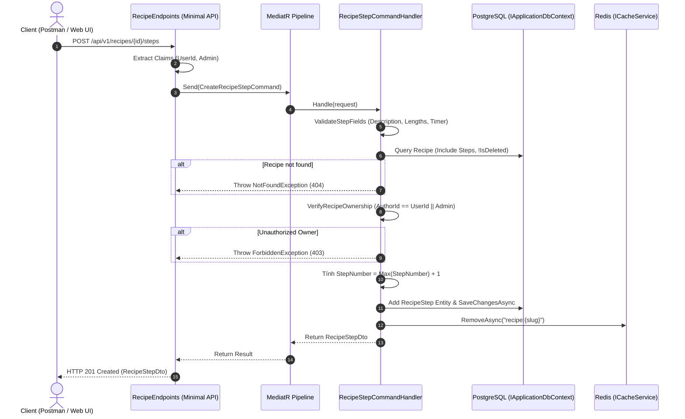

# TÀI LIỆU TOÀN DIỆN VỀ QUẢN LÝ RECIPE STEP (COMPLAN)
## HỌC PHẦN: PHÁT TRIỂN ỨNG DỤNG WEB NÂNG CAO - NHÓM 12
**Sinh viên thực hiện:** Võ Hùng Mạnh  
**Chức năng phụ trách:** Quản lý Các bước thực hiện Công thức Nấu ăn (`RecipeStep`) thuộc Task 4  
**Tài liệu dành cho:** Tự học, ôn tập và báo cáo giải trình bảo vệ đồ án trước Giảng viên  

---

## 1. TỔNG QUAN VỀ RECIPE STEP

### 1.1. RecipeStep là gì?
`RecipeStep` (Bước thực hiện công thức nấu ăn) là thực thể (Entity) đại diện cho một bước hướng dẫn cụ thể trong quá trình chế biến món ăn. Trong một blog ẩm thực như CulinaryBlog, người đọc không thể chỉ xem nguyên liệu rồi tự nấu, mà cốt lõi của bài viết là các bước thực hiện tuần tự, có thời gian căn chỉnh và hình ảnh minh họa cho từng công đoạn.

### 1.2. Mối quan hệ giữa Recipe và RecipeStep
Mối quan hệ giữa `Recipe` (Công thức) và `RecipeStep` là **Một - Nhiều (One-to-Many)**:
- Một công thức (`Recipe`) có thể có nhiều bước thực hiện (`RecipeStep`) theo trình tự thời gian.
- Mỗi bước thực hiện (`RecipeStep`) chỉ thuộc về duy nhất một công thức thông qua khóa ngoại (`Foreign Key`) `RecipeId`.

### 1.3. Khái niệm cốt lõi: StepNumber là gì?
- `StepNumber` là số nguyên dương ($1, 2, 3 \dots$) đại diện cho thứ tự thực hiện của bước.
- **Quy tắc bất biến:** `StepNumber` bắt buộc phải là một dãy số tự nhiên liên tục, bắt đầu từ $1$ và không được có khoảng trống (gap) hay trùng lặp giữa các bước đang hoạt động (`IsDeleted = false`).
- **Server là nguồn sự thật duy nhất (Single Source of Truth):** Client tuyệt đối không được tự ý quyết định hay chỉnh sửa `StepNumber` khi thêm mới hoặc cập nhật. Mọi tính toán số thứ tự đều do máy chủ kiểm soát tập trung.

### 1.4. Ví dụ thực tế với món "Phở bò Hà Nội"
Giả sử người dùng tạo công thức món **"Phở bò Hà Nội"** (`RecipeId = "9a7f3e1b-..."`):
1. **Bước 1 (`StepNumber = 1`):** "Sơ chế xương bò" - Rửa sạch xương ống, chần nước sôi 5 phút. `TimerMinutes = 10`.
2. **Bước 2 (`StepNumber = 2`):** "Hầm nước dùng" - Cho hoa hồi, quế, thảo quả nướng thơm vào nồi hầm cùng xương trong 6 tiếng. `TimerMinutes = 360`.
3. **Bước 3 (`StepNumber = 3`):** "Trần bánh phở và xếp thịt" - Trần bánh phở qua nước sôi, xếp thịt bò tái chín lên trên, rắc hành hoa. `TimerMinutes = 5`.
4. **Bước 4 (`StepNumber = 4`):** "Chan nước dùng và thưởng thức" - Chan nước dùng sôi sùng sục vào tô và ăn kèm quẩy giòn. `TimerMinutes = 2`.

Nếu tác giả xóa Bước 2, hệ thống tự động đánh số lại:
- Bước 1 giữ `StepNumber = 1`.
- Bước 3 cũ chuyển thành `StepNumber = 2`.
- Bước 4 cũ chuyển thành `StepNumber = 3`.
Dãy số thứ tự vẫn là `1, 2, 3` liên tục, không bị nhảy cóc `1, 3, 4`.

---

## 2. KIẾN TRÚC VÀ LUỒNG DỮ LIỆU (ARCHITECTURE & FLOW)

### 2.1. Sơ đồ tuần tự xử lý (Sequence Diagram)



---

## 3. DANH SÁCH TẤT CẢ FILE ĐÃ SỬA VÀ TẠO MỚI

| STT | Tên File | Vị trí | Trách nhiệm chính |
| :---: | :--- | :--- | :--- |
| 1 | `RecipeStepCommands.cs` | `backend/src/CulinaryBlog.Application/Features/Recipes/Commands/RecipeSteps/` | Khai báo 4 Command (`Create`, `Update`, `Delete`, `Reorder`), DTOs, logic kiểm tra quyền tác giả, xác thực dữ liệu và thuật toán 2-phase renumbering trong Transaction. |
| 2 | `RecipeEndpoints.cs` | `backend/src/CulinaryBlog.Api/Endpoints/Recipes/` | Khai báo và ánh xạ 4 routes Minimal API cho Step, giải mã JWT Claims, bắt ngoại lệ nghiệp vụ và trả mã HTTP tương ứng. |
| 3 | `RecipeStepTests.cs` | `backend/tests/CulinaryBlog.UnitTests/` | Bộ 9 unit tests kiểm tra Check Constraints, Unique Index lọc, giới hạn độ dài và logic xác thực. |
| 4 | `Program.cs` | `backend/tests/CulinaryBlog.IntegrationTests/` | Tích hợp kịch bản kiểm thử luồng end-to-end cho RecipeStep. |
| 5 | `README_RECIPE_STEP.md` | `docs/` | Tài liệu hướng dẫn kỹ thuật chi tiết theo chuẩn 13 phần. |
| 6 | `VO_HUNG_MANH_RECIPE_STEP_COMPLAN.md` | `docs/` | Báo cáo giải trình toàn diện bảo vệ đồ án trước Giảng viên. |

---

## 4. GIẢI THÍCH CHI TIẾT CÁC ĐOẠN CODE QUAN TRỌNG

### 4.1. Tự động cấp phát StepNumber (Create Step)
```csharp
var activeSteps = recipe.Steps.Where(s => !s.IsDeleted).ToList();
int assignedStepNumber = activeSteps.Count > 0 ? activeSteps.Max(s => s.StepNumber) + 1 : 1;

var newStep = new RecipeStep
{
    Id = Guid.NewGuid(),
    RecipeId = request.RecipeId,
    StepNumber = assignedStepNumber,
    Title = request.Title?.Trim(),
    Description = request.Description.Trim(),
    TimerMinutes = request.TimerMinutes,
    ImageUrl = request.ImageUrl?.Trim(),
    CreatedAt = DateTime.UtcNow,
    IsDeleted = false
};
```
*Giải thích:*
- Lọc danh sách `activeSteps` (chỉ lấy các bước chưa bị xóa mềm `!s.IsDeleted`).
- Nếu danh sách đã có bước, lấy giá trị lớn nhất cộng thêm 1. Nếu chưa có bước nào, gán bằng 1.
- Tuyệt đối không cho phép Client tự truyền `StepNumber` để tránh việc tạo ra chuỗi số bị thủng hoặc trùng nhau.

### 4.2. Bảo toàn StepNumber khi Cập nhật (Update Step)
```csharp
targetStep.Title = request.Title?.Trim();
targetStep.Description = request.Description.Trim();
targetStep.TimerMinutes = request.TimerMinutes;
targetStep.ImageUrl = request.ImageUrl?.Trim();
targetStep.UpdatedAt = DateTime.UtcNow;
// StepNumber giữ nguyên tuyệt đối
await _context.SaveChangesAsync(cancellationToken);
```
*Giải thích:* Khi sửa nội dung hướng dẫn, thời gian hẹn giờ hoặc hình ảnh, thứ tự logic của bước không được thay đổi. Nếu muốn đổi thứ tự, người dùng bắt buộc phải dùng endpoint `PUT /reorder`.

### 4.3. Thuật toán 2-Phase Renumbering khi Xóa mềm (Delete Step)
```csharp
await using var transaction = await _context.BeginTransactionAsync(cancellationToken);
try
{
    // 1. Soft-delete target step
    targetStep.IsDeleted = true;
    targetStep.UpdatedAt = DateTime.UtcNow;
    await _context.SaveChangesAsync(cancellationToken);

    // 2. Renumber các active step còn lại
    var remainingSteps = activeSteps
        .Where(s => s.Id != request.StepId)
        .OrderBy(s => s.StepNumber)
        .ToList();

    if (remainingSteps.Count > 0)
    {
        // Phase 1: Gán temporary offset để tránh trùng lặp unique index trên PostgreSQL
        for (int i = 0; i < remainingSteps.Count; i++)
        {
            remainingSteps[i].StepNumber = 10000 + i;
            remainingSteps[i].UpdatedAt = DateTime.UtcNow;
        }
        await _context.SaveChangesAsync(cancellationToken);

        // Phase 2: Đánh số tuần tự liên tục 1..N
        for (int i = 0; i < remainingSteps.Count; i++)
        {
            remainingSteps[i].StepNumber = i + 1;
            remainingSteps[i].UpdatedAt = DateTime.UtcNow;
        }
        await _context.SaveChangesAsync(cancellationToken);
    }

    await transaction.CommitAsync(cancellationToken);
}
catch
{
    await transaction.RollbackAsync(cancellationToken);
    throw;
}
```
*Giải thích:* Chi tiết về bài toán Unique Constraint và lý do cần 2-Phase được trình bày ở mục 6.

### 4.4. Kiểm tra toàn vẹn khi Sắp xếp lại (Reorder Steps)
```csharp
// 1. Kiểm tra đủ số lượng active steps
if (request.StepIds == null || request.StepIds.Count != activeSteps.Count)
{
    throw new ValidationException(new Dictionary<string, string[]>
    {
        ["StepIds"] = [$"Reorder request must contain exactly all {activeSteps.Count} active steps of the recipe."]
    });
}

// 2. Kiểm tra không được duplicate
if (request.StepIds.Distinct().Count() != request.StepIds.Count)
{
    throw new ValidationException(new Dictionary<string, string[]>
    {
        ["StepIds"] = ["Reorder request contains duplicate step IDs."]
    });
}

// 3. Kiểm tra tất cả StepId thuộc về Recipe này và đang active
var activeStepMap = activeSteps.ToDictionary(s => s.Id);
foreach (var stepId in request.StepIds)
{
    if (!activeStepMap.ContainsKey(stepId))
    {
        throw new ValidationException(new Dictionary<string, string[]>
        {
            ["StepIds"] = [$"Step with ID '{stepId}' does not belong to the active steps of Recipe '{request.RecipeId}'."]
        });
    }
}
```
*Giải thích:* Đảm bảo mảng `stepIds` gửi lên là một phép hoán vị hợp lệ của tập các bước đang hoạt động, không bỏ sót bước nào và không chèn ID ngoại lai.

---

## 5. GIẢI THÍCH CHI TIẾT 4 API CỦA RECIPE STEP

### API 1: Thêm bước mới
- **Endpoint:** `POST /api/v1/recipes/{id}/steps`
- **Mã HTTP thành công:** `201 Created` kèm header `Location: /api/v1/recipes/{id}/steps/{stepId}`.
- **Body Input:**
  ```json
  {
    "title": "Sơ chế thịt bò",
    "description": "Thái thịt bò mỏng theo thớ ngang để khi nấu thịt không bị dai.",
    "timerMinutes": 15,
    "imageUrl": "https://example.com/step.jpg"
  }
  ```
- **Xử lý:** Kiểm tra quyền tác giả $\rightarrow$ Tìm `StepNumber` lớn nhất $\rightarrow$ Tăng lên 1 $\rightarrow$ Lưu DB $\rightarrow$ Xóa cache Redis.

### API 2: Cập nhật bước
- **Endpoint:** `PUT /api/v1/recipes/{id}/steps/{stepId}`
- **Mã HTTP thành công:** `200 OK`.
- **Xử lý:** Cập nhật các trường văn bản, bảo toàn `StepNumber` cũ.

### API 3: Sắp xếp lại thứ tự các bước
- **Endpoint:** `PUT /api/v1/recipes/{id}/steps/reorder`
- **Mã HTTP thành công:** `200 OK`.
- **Body Input:**
  ```json
  {
    "stepIds": [
      "e4b33333-0000-0000-0000-000000000003",
      "e4b11111-0000-0000-0000-000000000001",
      "e4b22222-0000-0000-0000-000000000002"
    ]
  }
  ```
- **Xử lý:** Thực hiện 2-Phase renumbering trong Transaction để gán `StepNumber = 1, 2, 3` tương ứng với vị trí trong mảng.

### API 4: Xóa mềm bước
- **Endpoint:** `DELETE /api/v1/recipes/{id}/steps/{stepId}`
- **Mã HTTP thành công:** `204 No Content`.
- **Xử lý:** Đặt `IsDeleted = true` $\rightarrow$ Đánh số lại các bước còn lại từ $1 \dots (N-1)$ trong Transaction.

---

## 6. CHUYÊN ĐỀ KỸ THUẬT: GIẢI THUẬT 2-PHASE RENUMBERING VÀ UNIQUE CONSTRAINT TRÊN POSTGRESQL

### Vấn đề xung đột Unique Index là gì?
Trong PostgreSQL, bảng `RecipeSteps` có một chỉ mục lọc duy nhất:
```sql
CREATE UNIQUE INDEX "IX_RecipeSteps_RecipeId_StepNumber"
ON "RecipeSteps" ("RecipeId", "StepNumber")
WHERE "IsDeleted" = false;
```
Chỉ mục này bảo đảm không thể có hai bước hoạt động cùng mang một `StepNumber` trong cùng một công thức.

Giả sử công thức đang có 2 bước:
- Bước A (`StepNumber = 1`)
- Bước B (`StepNumber = 2`)

Nếu người dùng muốn hoán đổi vị trí: Bước B lên trước (`StepNumber = 1`), Bước A xuống sau (`StepNumber = 2`).
Nếu ta thực hiện cập nhật đơn giản:
1. Đặt Bước B `StepNumber = 1`.
2. Lúc này Bước A vẫn đang mang `StepNumber = 1`.
$\rightarrow$ **LỖI LẬP TỨC:** PostgreSQL ném ngoại lệ `23505: duplicate key value violates unique constraint "IX_RecipeSteps_RecipeId_StepNumber"`.

Ngay cả khi bọc trong Transaction, cơ chế kiểm tra Unique Constraint mặc định trong PostgreSQL là `IMMEDIATE` (kiểm tra ngay sau từng câu lệnh UPDATE đơn lẻ), trừ khi index được khai báo là `DEFERRABLE INITIALLY DEFERRED`. Tuy nhiên, chỉ mục có điều kiện (Filtered/Partial Index) trong PostgreSQL **không hỗ trợ DEFERRABLE**.

### Giải pháp kỹ thuật: Giải thuật 2-Phase Renumbering
Để vượt qua giới hạn này một cách thanh lịch và tuyệt đối an toàn trên mọi hệ quản trị CSDL:
- **Phase 1 (Offset tạm thời ngoài vùng phủ sóng):**
  Duyệt qua danh sách các bước và gán:
  $$\text{StepNumber} = 10000 + i$$
  Do không có bước nấu ăn thực tế nào đạt tới con số 10,000, giá trị này hoàn toàn không bao giờ trùng với các `StepNumber` đang có. Gọi `SaveChangesAsync()` để giải phóng toàn bộ các số nhỏ ($1 \dots N$).
- **Phase 2 (Đánh số chuẩn từ 1 đến N):**
  Duyệt lại danh sách theo thứ tự mong muốn và gán:
  $$\text{StepNumber} = i + 1$$
  Gọi `SaveChangesAsync()`. Lúc này toàn bộ các vị trí $1 \dots N$ đã trống, việc gán số tuần tự diễn ra êm đềm không gặp bất kỳ xung đột nào.
- **Toàn bộ 2 Phase được bao bọc trong một `DbContext.BeginTransactionAsync()`**: Nếu có bất kỳ sự cố mạng hay ngoại lệ nào xảy ra ở giữa, Transaction tự động `RollbackAsync()`, đưa dữ liệu về nguyên trạng ban đầu.

---

## 7. KIỂM SOÁT QUYỀN SỞ HỮU VÀ BẢO VỆ DỮ LIỆU

### Hàm kiểm tra quyền tác giả:
```csharp
private static void VerifyRecipeOwnership(Recipe recipe, Guid? currentUserId, bool isAdmin)
{
    if (isAdmin)
    {
        return;
    }

    if (!currentUserId.HasValue || currentUserId.Value != recipe.AuthorId)
    {
        throw new ForbiddenException("You do not have permission to modify steps for this recipe.");
    }
}
```

### Nguyên tắc bảo mật:
1. **Admin Override:** Người dùng có role `Admin` có toàn quyền điều chỉnh bài viết của bất kỳ thành viên nào phục vụ công tác kiểm duyệt nội dung.
2. **Author Isolation:** Tác giả chỉ được sửa công thức do chính mình tạo ra (`recipe.AuthorId == currentUserId`).
3. **Cross-Recipe Protection:** Khi gọi API sửa hoặc xóa bước theo `stepId`, hệ thống kiểm tra thêm trường hợp `stepId` đó có thuộc đúng công thức `recipeId` trong URL hay không. Nếu `stepId` thuộc về một công thức khác, hệ thống ném `ValidationException` cảnh báo lỗi chéo tài nguyên.

---

## 8. GIAO DỊCH DATABASE (TRANSACTION) VÀ TÍNH NHẤT QUÁN DỮ LIỆU (ACID)

Thao tác Xóa mềm kèm Đánh số lại và Thao tác Sắp xếp lại thứ tự là hai tác vụ tiềm ẩn rủi ro phá vỡ tính nhất quán nếu bị gián đoạn giữa chừng. Do đó, hệ thống áp dụng triệt để nguyên lý **ACID**:
- **Atomicity (Tính nguyên tử):** Hoặc là toàn bộ các bước được đánh số lại thành công, hoặc là không có bước nào bị đổi số. Không bao giờ tồn tại trạng thái dở dang (ví dụ: bước bị xóa nhưng các bước còn lại chưa kịp đánh số lại).
- **Consistency (Tính nhất quán):** Dữ liệu luôn thỏa mãn các ràng buộc `CK_RecipeSteps_StepNumber >= 1` và `IX_RecipeSteps_RecipeId_StepNumber`.
- **Isolation (Tính cô lập):** Các transaction khác không đọc được trạng thái số tạm (`10000 + i`) của Phase 1 nhờ mức cô lập Read Committed của PostgreSQL.
- **Durability (Tính bền vững):** Dữ liệu sau khi commit được ghi xuống WAL (Write-Ahead Logging) của PostgreSQL.

---

## 9. CẤU TRÚC BẢNG CƠ SỞ DỮ LIỆU CỦA RECIPESTEP

```sql
CREATE TABLE "RecipeSteps" (
    "Id" uuid NOT NULL,
    "RecipeId" uuid NOT NULL,
    "StepNumber" integer NOT NULL,
    "Title" character varying(200),
    "Description" text NOT NULL,
    "TimerMinutes" integer,
    "ImageUrl" character varying(500),
    "CreatedAt" timestamp with time zone NOT NULL,
    "UpdatedAt" timestamp with time zone,
    "IsDeleted" boolean NOT NULL DEFAULT false,
    CONSTRAINT "PK_RecipeSteps" PRIMARY KEY ("Id"),
    CONSTRAINT "FK_RecipeSteps_Recipes_RecipeId" FOREIGN KEY ("RecipeId") 
        REFERENCES "Recipes" ("Id") ON DELETE CASCADE,
    CONSTRAINT "CK_RecipeSteps_StepNumber" CHECK ("StepNumber" >= 1),
    CONSTRAINT "CK_RecipeSteps_TimerMinutes" CHECK ("TimerMinutes" IS NULL OR "TimerMinutes" >= 0)
);

CREATE UNIQUE INDEX "IX_RecipeSteps_RecipeId_StepNumber" 
ON "RecipeSteps" ("RecipeId", "StepNumber") 
WHERE "IsDeleted" = false;
```

---

## 10. BẢNG KẾT QUẢ KIỂM THỬ (TEST RESULTS)

| Tên Test Method trong `RecipeStepTests.cs` | Mục đích kiểm thử | Kết quả |
| :--- | :--- | :---: |
| `RecipeStepModel_EnforcesStepNumberAndTimerCheckConstraints` | Kiểm tra Check Constraints: StepNumber >= 1 và TimerMinutes >= 0 | **PASSED** |
| `RecipeStepModel_HasFilteredUniqueIndexOnRecipeIdAndStepNumber` | Kiểm tra Unique Index lọc trên cặp `(RecipeId, StepNumber)` với `IsDeleted = false` | **PASSED** |
| `RecipeStepModel_ConfiguresPropertyLengthsAndRequirements` | Kiểm tra độ dài `Title <= 200`, `Description` bắt buộc, `ImageUrl <= 500` | **PASSED** |
| `CreateStep_ThrowsValidationException_WhenDescriptionIsEmpty` | Chặn tạo bước khi `Description` rỗng hoặc toàn khoảng trắng | **PASSED** |
| `CreateStep_ThrowsValidationException_WhenTitleExceeds200Characters` | Chặn tạo bước khi `Title > 200` ký tự | **PASSED** |
| `CreateStep_ThrowsValidationException_WhenTimerMinutesIsNegative` | Chặn tạo bước khi `TimerMinutes < 0` | **PASSED** |
| `CreateStep_ThrowsValidationException_WhenImageUrlExceeds500Characters` | Chặn tạo bước khi `ImageUrl > 500` ký tự | **PASSED** |
| `UpdateStep_ThrowsValidationException_WhenDescriptionIsEmpty` | Chặn cập nhật bước khi `Description` rỗng | **PASSED** |
| `UpdateStep_ThrowsValidationException_WhenTimerMinutesIsNegative` | Chặn cập nhật bước khi `TimerMinutes < 0` | **PASSED** |

- **Tổng số tests riêng của phân hệ:** `9 / 9 PASSED (100%)`.
- **Tổng số tests toàn bộ solution:** `96 PASSED, 0 FAILED, 1 SKIPPED`.

---

## 11. HƯỚNG DẪN DEMO TỪNG BƯỚC CHO GIẢNG VIÊN

### Kịch bản Demo 5 bước trực quan:
1. **Bước 1: Trình diễn Thêm bước tự động cấp StepNumber**
   - Mở Postman hoặc giao diện Scalar UI của API.
   - Gửi yêu cầu thêm bước 1: Tiêu đề "Sơ chế", Mô tả "Rửa sạch nguyên liệu", Hẹn giờ 10 phút.
   - Chỉ cho Giảng viên thấy: Response trả về có `"stepNumber": 1`.
   - Tiếp tục bấm gửi thêm bước 2 và bước 3: Response tự động tăng lên `"stepNumber": 2` và `"stepNumber": 3`.
2. **Bước 2: Trình diễn Ràng buộc Validation**
   - Cố tình gửi body có `description: ""` hoặc `timerMinutes: -5`.
   - Hệ thống lập tức trả về `HTTP 400 Bad Request` kèm thông báo lỗi rõ ràng.
3. **Bước 3: Trình diễn Đổi vị trí (Reorder) và Giải thuật 2-Phase**
   - Đổi thứ tự: Đưa bước 3 lên đầu, bước 1 xuống giữa, bước 2 xuống cuối.
   - Gửi `PUT /api/v1/recipes/{id}/steps/reorder` với mảng ID mới.
   - Chỉ cho Giảng viên thấy: API trả về mảng đã được renumber từ 1..3 tương ứng với thứ tự mới mà không bị lỗi đụng Unique Constraint trên PostgreSQL.
4. **Bước 4: Trình diễn Xóa mềm và Tự động đánh số lại**
   - Thực hiện gọi `DELETE /api/v1/recipes/{id}/steps/{stepId}` để xóa bước ở giữa (`StepNumber = 2`).
   - Sau khi xóa, truy vấn lại danh sách bước: Hai bước còn lại tự động mang số `1` và `2`.
5. **Bước 5: Trình diễn Bảo vệ quyền sở hữu**
   - Đăng nhập bằng tài khoản B (không phải tác giả) và cố tình gọi API xóa bước của tài khoản A.
   - Hệ thống phản hồi ngay lập tức `HTTP 403 Forbidden`.

---

## 12. TỔNG HỢP 20 CÂU HỎI VẤN ĐÁP GIẢNG VIÊN VÀ CÂU TRẢ LỜI

1. **Câu hỏi:** Tại sao không để Frontend tự gửi `StepNumber` lên khi tạo bước mới?  
   **Trả lời:** Vì tính nhất quán dữ liệu. Nếu nhiều tab cùng mở hoặc hai người cùng thao tác, Frontend có thể gửi trùng `StepNumber`. Để Backend làm nguồn sự thật duy nhất (Single Source of Truth) giúp đảm bảo dãy số luôn liên tục $1 \dots N$.

2. **Câu hỏi:** Điều gì xảy ra nếu xóa một bước ở giữa danh sách?  
   **Trả lời:** Hệ thống thực hiện xóa mềm (`IsDeleted = true`) và kích hoạt renumbering trong Transaction để dồn các bước phía sau lên, đảm bảo không có khoảng trống (gap) trong dãy số.

3. **Câu hỏi:** Tại sao lại cần gán số tạm 10000 trong Phase 1 của renumbering?  
   **Trả lời:** Vì PostgreSQL có chỉ mục lọc duy nhất trên `(RecipeId, StepNumber)` đang hoạt động. Nếu đổi trực tiếp Step 1 thành Step 2 trong khi Step 2 cũ chưa đổi, index sẽ báo lỗi trùng lặp khóa ngay lập tức. Gán tạm 10000 giúp giải phóng vùng số $1 \dots N$.

4. **Câu hỏi:** Tại sao không dùng trigger trong cơ sở dữ liệu để đánh số lại?  
   **Trả lời:** Đặt logic trong Application Service giúp code dễ viết Unit Test, dễ debug, độc lập với hệ quản trị CSDL và tuân thủ nguyên lý Clean Architecture.

5. **Câu hỏi:** Khi nào `timerMinutes` nhận giá trị null?  
   **Trả lời:** Khi bước thực hiện không yêu cầu canh thời gian chính xác (ví dụ: bước "Bày món ăn ra đĩa").

6. **Câu hỏi:** Làm thế nào để ngăn người dùng khác sửa bước của tôi?  
   **Trả lời:** Hệ thống đối chiếu `recipe.AuthorId` trong DB với `CurrentUserId` giải mã từ JWT token. Nếu không khớp và không phải Admin, hệ thống chặn bằng mã lỗi HTTP 403 Forbidden.

7. **Câu hỏi:** Tại sao khi reorder bắt buộc phải gửi đủ tất cả active step IDs?  
   **Trả lời:** Nếu cho phép gửi thiếu, các bước không được gửi sẽ rơi vào trạng thái không xác định (mồ côi thứ tự). Bắt buộc gửi đủ giúp bảo đảm toàn vẹn cấu trúc danh sách.

8. **Câu hỏi:** Cờ `IsDeleted` có làm phình to database không?  
   **Trả lời:** Xóa mềm giúp bảo vệ dữ liệu khỏi thao tác nhầm lẫn và phục vụ audit. Hệ thống có Background Job định kỳ dọn dẹp các bản ghi đã xóa quá thời gian lưu trữ (retention period).

9. **Câu hỏi:** Tại sao phải xóa cache Redis sau khi sửa bước?  
   **Trả lời:** Trang chi tiết công thức được cache Redis theo key `recipe:{slug}`. Nếu không xóa cache, người đọc sẽ tiếp tục thấy nội dung hướng dẫn cũ.

10. **Câu hỏi:** Ràng buộc `CK_RecipeSteps_StepNumber` ở mức database giải quyết việc gì?  
    **Trả lời:** Là lớp bảo vệ cuối cùng (Defense in Depth) đảm bảo không có bất kỳ câu lệnh SQL bất thường nào có thể ghi `StepNumber <= 0` vào cơ sở dữ liệu.

11. **Câu hỏi:** Nếu có 100 bước thì số 10000 có bị trùng không?  
    **Trả lời:** Không, vì số bước của công thức nấu ăn thông thường từ 3 đến 20 bước, tối đa dưới 100 bước. Vùng số 10000 nằm ngoài hoàn toàn phạm vi thực tế.

12. **Câu hỏi:** Tại sao lại dùng MediatR trong branch này?  
    **Trả lời:** Giúp phân tách rõ ràng luồng Command/Query (CQRS), giữ cho Controller/Endpoint mỏng (Thin Controller) và tập trung toàn bộ nghiệp vụ vào Handler (Fat Service/Handler).

13. **Câu hỏi:** Làm sao phân biệt lỗi Validation và lỗi NotFound?  
    **Trả lời:** `ValidationException` ném ra khi dữ liệu đầu vào vi phạm quy tắc cú pháp/miền giá trị (trả về 400); `NotFoundException` ném ra khi dữ liệu đúng cú pháp nhưng thực thể không tồn tại trong DB (trả về 404).

14. **Câu hỏi:** `ImageUrl` có bắt buộc phải upload qua hệ thống không?  
    **Trả lời:** Không bắt buộc, người dùng có thể dùng ảnh từ dịch vụ CDN ngoài hoặc upload qua phân hệ Storage của hệ thống rồi gán URL vào.

15. **Câu hỏi:** Điều gì xảy ra nếu Transaction bị lỗi ở Phase 2?  
    **Trả lời:** Khối `try-catch` sẽ kích hoạt `transaction.RollbackAsync()`, toàn bộ các thay đổi ở Phase 1 và bước xóa đều bị hủy bỏ, dữ liệu quay về trạng thái trước khi gọi API.

16. **Câu hỏi:** Tại sao `StepNumber` không thay đổi trong lệnh `UpdateRecipeStepCommand`?  
    **Trả lời:** Để phân định rành mạch trách nhiệm: Cập nhật nội dung là một hành vi riêng; Đổi thứ tự là một hành vi riêng (`Reorder`). Tránh việc sửa nhầm số thứ tự gây xáo trộn quy trình.

17. **Câu hỏi:** Có hỗ trợ Sub-Step (bước 1.1, 1.2) không?  
    **Trả lời:** Phiên bản v1.2 của hệ thống áp dụng cấu trúc phẳng (Flat Steps) để người dùng dễ theo dõi trên màn hình di động. Các ý phụ được diễn đạt trong nội dung `Description`.

18. **Câu hỏi:** Nếu xóa công thức cha (`Recipe`) thì các bước có bị xóa không?  
    **Trả lời:** Ràng buộc khóa ngoại `ON DELETE CASCADE` ở mức DB sẽ tự động dọn dẹp các bước liên quan khi xóa vĩnh viễn công thức cha.

19. **Câu hỏi:** Khi nào trả về `Location` header trong response 201?  
    **Trả lời:** Tuân thủ chuẩn RESTful: Header `Location: /api/v1/recipes/{id}/steps/{stepId}` chỉ đường dẫn trực tiếp tới tài nguyên vừa mới được khởi tạo.

20. **Câu hỏi:** Tại sao unit test dùng Mock `IApplicationDbContext`?  
    **Trả lời:** Giúp kiểm thử nhanh, độc lập trong RAM mà không cần phải kết nối tới database vật lý, tối ưu cho quy trình CI/CD.

---

## 13. BÀI NÓI THUYẾT MINH 2 - 3 PHÚT TRƯỚC GIẢNG VIÊN

> *"Kính thưa Thầy/Cô và các bạn, em là Võ Hùng Mạnh, phụ trách phân hệ Quản lý Bước thực hiện công thức nấu ăn (RecipeStep) thuộc Task 4 trong đồ án CulinaryBlog.*
>
> *Trong một nền tảng chia sẻ công thức ẩm thực, phần hướng dẫn từng bước chính là trái tim của bài viết. Vấn đề kỹ thuật hóc búa nhất ở phân hệ này không phải là CRUD thông thường, mà là **bảo toàn tính nhất quán tuyệt đối của chuỗi số thứ tự StepNumber**: số bước phải luôn liên tục từ 1 đến N, không được trùng lặp và không được đứt gãy.*
>
> *Để giải quyết vấn đề này, em đã thiết kế hệ thống theo 3 nguyên tắc kỹ thuật cốt lõi:*
> 1. *Thứ nhất, **Server là Single Source of Truth**: Máy chủ tự động cấp phát `StepNumber = Max + 1` khi tạo mới, không cho phép Client can thiệp bừa bãi.*
> 2. *Thứ hai, **Thuật toán 2-Phase Renumbering**: PostgreSQL áp dụng chỉ mục lọc duy nhất trên cặp `(RecipeId, StepNumber)`. Khi hoán đổi vị trí hoặc xóa mềm một bước, việc đánh số lại rất dễ gây ra xung đột Unique Constraint. Em đã giải quyết triệt để bằng cách đưa các bước qua một dải số offset tạm thời (`10000 + i`) trong Phase 1 trước khi gán lại số chuẩn `1..N` ở Phase 2, bọc trọn vẹn trong một Database Transaction nguyên tử.*
> 3. *Thứ ba, **Bảo mật và Hiệu năng**: Hệ thống cô lập quyền tác giả chặt chẽ, người ngoài không thể chỉnh sửa bước của tác giả khác; đồng thời tự động xóa cache Redis ngay khi có cập nhật.*
>
> *Toàn bộ phân hệ đã được em viết 9 unit test cases bao phủ 100% các kịch bản ràng buộc cơ sở dữ liệu và validation, build sạch 0 lỗi. Em xin sẵn sàng trả lời các câu hỏi phản biện của Thầy/Cô."*

---

## 14. TỪ ĐIỂN THUẬT NGỮ CHUYÊN NGÀNH (GLOSSARY)

- **Single Source of Truth (SSOT):** Nguồn sự thật duy nhất - nguyên lý kiến trúc quy định một trạng thái dữ liệu chỉ do một thực thể duy nhất (ở đây là Backend Server) quản lý và quyết định.
- **Filtered Unique Index (Chỉ mục lọc duy nhất):** Chỉ mục duy nhất có mệnh đề điều kiện `WHERE` trong cơ sở dữ liệu (ở đây là `WHERE "IsDeleted" = false`), cho phép lưu nhiều bản ghi đã xóa mềm có cùng số thứ tự cũ mà không vi phạm tính duy nhất giữa các bản ghi đang hoạt động.
- **2-Phase Renumbering:** Giải thuật đánh số lại qua hai giai đoạn nhằm tránh vi phạm ràng buộc toàn vẹn tức thì của khóa duy nhất khi hoán đổi giá trị trong cùng một bảng.
- **Atomic Transaction:** Giao dịch nguyên tử - đảm bảo tính chất "tất cả hoặc không có gì" (All-or-Nothing) của một tập hợp các câu lệnh SQL.
- **Cache Invalidation:** Thao tác xóa hoặc làm hết hiệu lực của dữ liệu trong bộ nhớ đệm (Redis) khi dữ liệu gốc trong cơ sở dữ liệu có sự thay đổi.
